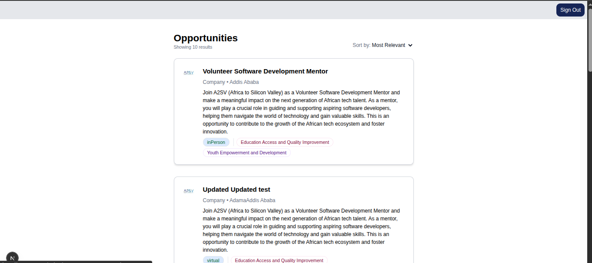
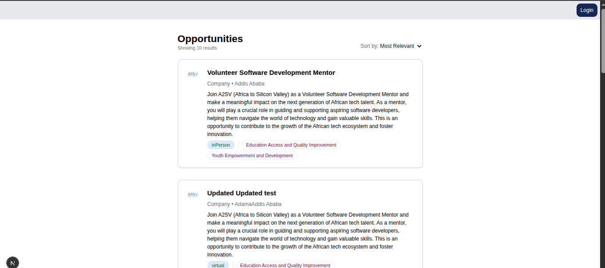

# 💼 Job Listing User Authentication (Task 8)

A modern and responsive Job Listing Dashboard built with **React (Next.js)** and **Tailwind CSS**, designed to showcase job applicants and listings in a clean, professional UI. This project is part of a hands-on task series to master frontend development through building real-world projects.

This task adds secure user authentication using **NextAuth** with API integration for user registration, verify OTP and login.


---

### 🔐 Authentication Features

- 🆕 Signup and Signin pages designed using Figma UI references
- 🔒 Secure login via token-based authentication
- 📬 Email verification using OTP flow
- 🧠 Graceful error handling and form validation
- 🔄 Integrated with provided `/signup`, `/login`, and `/verify-email` endpoints

---

## 📸 Screenshots

#### 🔹 Sign In Page


> *Simple, accessible Sign In UI with client-side validation.*

---

#### 🔹 Sign Up Page


> *Signup form with proper role selection, password validation, and form feedback.*

---

#### 🔹 Verify Email Page


> *OTP verification *

---

### 🔹 Job Listing Page (Live Data)

Displays job listings fetched from the API using React Query after logged in.


> *Shows multiple applicant/job cards rendered dynamically. Cards dynamically populated from the API.*


---
Displays job listings fetched from the API using React Query after logged out.


> *Shows multiple applicant/job cards rendered dynamically. Cards dynamically populated from the API.*

---

### 🧪 API Endpoints

**Base URL**: `https://akil-backend.onrender.com/`

| Endpoint           | Method | Description                         |
|--------------------|--------|-------------------------------------|
| `/signup`          | POST   | Register a new user                 |
| `/verify-email`    | POST   | Verify user email via OTP           |
| `/login`           | POST   | Authenticate user and return token  |


## 🛠️ Tech Stack

- **Framework**: [Next.js 15](https://nextjs.org)
- **React**: v19
- **Styling**: [Tailwind CSS v4](https://tailwindcss.com)
- **Data Fetching**: [React Query](https://tanstack.com/query)
- **Icons**: [Heroicons](https://heroicons.com)
- **Auth**: [NextAuth](https://next-auth.js.org)

---

## 📁 Project Structure
```bash
job-listing-app/
│
├── app/
│   ├── auth/
│   │   ├── signin/page.tsx        # Signin Page
│   │   ├── verifyEmail/page.tsx   # Verify Email Page
│   │   └── signup/page.tsx        # Signup Page
│   ├── jobs/
│   │   ├── [id]/                  # Dynamic route for job detail
│   │   └── page.tsx               # Job listings
│   ├── api/auth/[...nextauth]
│   │   ├── options.ts     
│   │   └── route.ts                         
│   ├── globals.css                # Tailwind base styles
│   ├── layout.tsx                 # App layout
│   ├── page.tsx                   # Home page
│   └── provider.tsx               # Context/Providers (Redux, Query)
│
├── components/
│   ├── about.tsx
│   ├── JobCard.tsx
│   ├── tag.tsx
│   ├── Login.tsx
│   ├── Signup.tsx
│   ├── Nav.tsx
│   └── VerifyEmail.tsx               
│
├── lib/
│   ├── service/
│   │   ├── opportunitiesApi.ts    # Job API calls
│   │   └── authApi.ts             # Auth API calls
│   └── store.ts                   # Redux store
│
├── public/
│   └── assets/
│       └── screenshots/           # Screenshots used in README
│           ├── joblist1.png
│           ├── joblist2png
│           ├── VerifyEmail.png
│           ├── signin.png
│           └── signup.png
│
├── type/
│   ├── jobs.ts
│   └── auth.ts
│
├── .gitignore
├── README.md
├── package.json
├── tsconfig.json
├── next.config.ts
└── postcss.config.mjs
```
## 🔌 API Endpoint Reference

**Base URL:**  
`https://akil-backend.onrender.com`

### 📥 Endpoints

#### 📄 Get All Opportunities
- **URL:** `/opportunities/search`
- **Method:** `GET`
- **Description:** Fetches a list of available opportunities.

#### 🔍 Get Opportunity by ID
- **URL:** `/opportunities/:id`
- **Method:** `GET`
- **Description:** Fetches a specific opportunity using its unique ID.  
- **Example:** `/opportunities/6526382983jsdu8d7`

---

## 📦 Installation & Setup

```bash
# Clone the repository
git clone https://github.com/BeamSol/A2SV-Web-Project-Phase.git

# Navigate into the project
cd job-listing-app-task8

# Install dependencies
npm install

# Run development server
npm run dev
```
--- 

## 🙌 Author

**Beamlak Solomon**  
Software Engineering Student | Frontend Developer 
[LinkedIn](https://www.linkedin.com/in/beamlak-solomon-540890264/) | [GitHub](https://github.com/BeamSol)

---