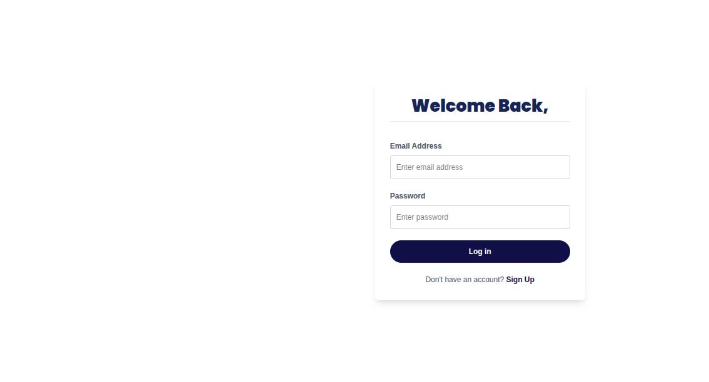
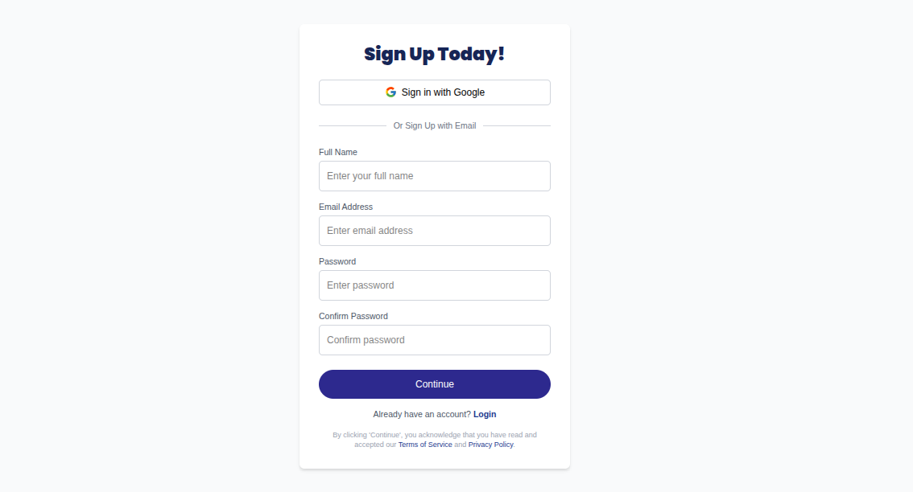
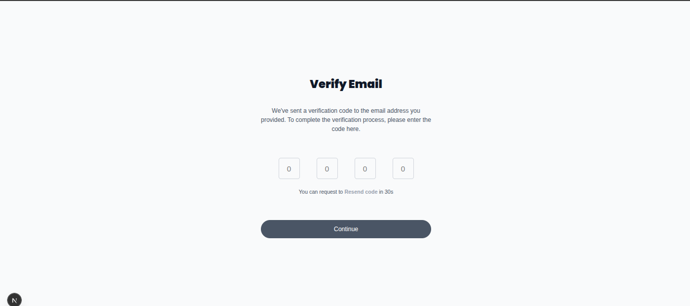

# 💼 Job Listing Dashboard with Bookmarking & Testing

A modern and responsive Job Listing Dashboard built with **React (Next.js)** and **Tailwind CSS**. It features secure user authentication, dynamic job listings, and a new **bookmarking system**. This project is part of a hands-on task series to master frontend development through building real-world projects.

This task enhances the dashboard by adding a **bookmarking feature**, allowing users to save their favorite job listings. The application is now rigorously tested using **Cypress** for end-to-end user flows and **Jest** for component-level unit testing.

---

### ✨ Key Features

- 🆕 **Secure User Authentication**: Full signup, login, and OTP email verification flow using **NextAuth.js**.
- 🔖 **Bookmarking Functionality**: Authenticated users can save or remove jobs from their personal bookmarks.
- ⚛️ **Dynamic Job Listings**: Job cards are fetched and rendered dynamically from a live API.
- 🧪 **Comprehensive Testing**: End-to-end tests with Cypress and unit tests with Jest ensure application reliability.
- 🧠 **Graceful UX**: Smooth loading states, client-side form validation, and user feedback with toast notifications.
- 🔄 **Integrated with Backend**: Connected to provided endpoints for authentication, job listings, and bookmark management.

---

## 📸 Screenshots

This section showcases the key user interfaces of the application.

### 🔹 Authentication Flow

| Sign In Page | Sign Up Page | Email Verification |
| :---: | :---: | :---: |
|  |  |  |
> *A complete and secure authentication flow with client-side validation and OTP verification.*

---

### 🔹 Core Feature: Job Bookmarking

This feature allows authenticated users to save and manage their favorite job listings directly from the main dashboard.

| Adding a Bookmark | Removing a Bookmark |
| :---: | :---: |
|  |  |
> *Cypress tests verifying that an authenticated user can successfully add and remove a bookmark, with the UI updating correctly after each action.*

---

### 🔹 Robust Testing and Edge Cases

The application is tested against various scenarios to ensure stability and a predictable user experience.

| Persistent State on Reload | Handling Server Errors | Unauthenticated User Redirect |
| :---: | :---: | :---: |
|  |  |  |
> *End-to-end tests confirm that bookmarks persist after a page reload, server errors are handled gracefully with a toast notification, and unauthenticated users are properly redirected to the login page.*

---
## 🛠️ Tech Stack

This project is built with a modern, robust, and scalable technology stack.

- **Core Framework**: [Next.js 14](https://nextjs.org/) & [React 19](https://react.dev/)
- **Language**: [TypeScript](https://www.typescriptlang.org/)
- **Styling**: [Tailwind CSS](https://tailwindcss.com/)
- **State Management & Data Fetching**: [Redux Toolkit](https://redux-toolkit.js.org/) & [RTK Query](https://redux-toolkit.js.org/rtk-query/)
- **Form Handling**: [React Hook Form](https://react-hook-form.com/) with [Zod](https://zod.dev/) for schema validation
- **Authentication**: [NextAuth.js](https://next-auth.js.org/)
- **End-to-End Testing**: [Cypress](https://www.cypress.io/)
- **Unit & Component Testing**: [Jest](https://jestjs.io/) with [React Testing Library](https://testing-library.com/docs/react-testing-library/intro/)
- **UI & UX**:
  - **Icons**: [React Icons](https://react-icons.github.io/react-icons/)
  - **Notifications**: [React Hot Toast](https://react-hot-toast.com/)

## 📁 Project Structure

The project is organized with a clear separation of concerns, following Next.js conventions while accommodating a robust testing setup.

```bash
job-listing-app/
│
├── app/
│   ├── (auth)/                  # Route group for auth pages
│   │   ├── signin/page.tsx
│   │   ├── signup/page.tsx
│   │   └── verify-email/page.tsx
│   ├── jobs/
│   │   └── page.tsx               # Main job listings page
│   ├── api/auth/[...nextauth]/
│   │   └── route.ts               # NextAuth.js API route
│   ├── layout.tsx
│   └── provider.tsx               # Redux & other global providers
│
├── components/
│   ├── JobCard.tsx                # Component for a single job listing
│   ├── Login.tsx
│   ├── Signup.tsx
│   └── ...                      # Other reusable UI components
│
├── cypress/                       # E2E Tests
│   ├── e2e/
│   │   └── bookmark.cy.tsx        # E2E test for bookmark functionality
│   ├── fixtures/                  # Mock data for tests
│   ├── screenshots/               # Auto-generated screenshots from test runs
│   └── support/
│       ├── commands.ts            # Custom Cypress commands (e.g., cy.login)
│       └── e2e.ts                 # Cypress global support file
│
├── lib/                         # Core logic, services, and state
│   ├── bookmarkService.ts         # RTK Query service for bookmarks
│   ├── opportunitiesApi.ts      # RTK Query service for jobs
│   └── store.ts                   # Redux store configuration
│
├── public/
│   └── assets/
│       └── screenshots/           # Screenshots used in README
│
├── type/                        # TypeScript type definitions
│   ├── jobs.ts
│   └── auth.ts
│
├── __mocks__/                     # Mocks for Jest (e.g., for file imports)
│
├── .env.local                   # Environment variables (not committed)
├── .gitignore
├── README.md
├── cypress.config.ts            # Cypress configuration
├── jest.config.js               # Jest configuration
├── next.config.ts
├── package.json
└── tsconfig.json
```
--- 

## 📦 Installation & Setup

```bash
# Clone the repository
git clone https://github.com/BeamSol/A2SV-Web-Project-Phase.git

# Navigate into the project
cd Final Task

# Install dependencies
npm install

# Run development server
npm run dev
```
--- 

## 🙌 Author

**Beamlak Solomon**  
Software Engineering Student | Frontend Developer 
[LinkedIn](https://www.linkedin.com/in/beamlak-solomon-540890264/) | [GitHub](https://github.com/BeamSol)

---