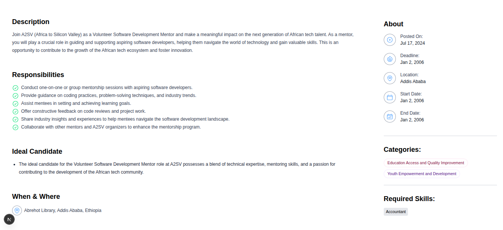

# 💼 Job Listing API Integration (Task 7)

A modern and responsive Job Listing Dashboard built with **React (Next.js)** and **Tailwind CSS**, designed to showcase job applicants and listings in a clean, professional UI. This project is part of a hands-on task series to master frontend development through building real-world projects.

This task enhances the Job Listing Application by integrating real-time data from a live API using React Query, replacing static dummy data with dynamic content from the backend. This is part of the A2SV Web Development Phase to practice full-stack integration.


---

## 🚀 Features(Updated)
 
- 🔄 Real-time API integration with React Query
- 📦 Fetches job opportunities from a remote server
- 🧠 Handles loading and error states gracefully
- ⚡ Optimized performance through React Query's caching layer
- ✅ Seamless replacement of static dummy data with live backend data

---

## 📸 Screenshots

### 🔹 Job Listing Page (Live Data)

Displays job listings fetched from the API using React Query.


> *Shows multiple applicant/job cards rendered dynamically. Cards dynamically populated from the API.*


---

### 🔹 Job Detail View

Displays a single job description with applicant details.


> *Includes job title, description, and stylized UI with proper spacing and hierarchy.*

---

## 🛠️ Tech Stack

- **Framework**: [Next.js 15](https://nextjs.org)
- **React**: v19
- **Styling**: [Tailwind CSS v4](https://tailwindcss.com)
- **Data Fetching**: [React Query](https://tanstack.com/query)
- **Icons**: [Heroicons](https://heroicons.com)

---

## 📁 Project Structure
```bash
job-listing-app/
│
├── app/
│   ├── jobs/
│   │   ├── [id]/                   # Dynamic route for job detail page
│   │   └── page.tsx                # Job listing dashboard page
│   ├── favicon.ico                 # Favicon for the app
│   ├── globals.css                 # Tailwind base styles
│   ├── layout.tsx                  # App layout component
│   ├── page.tsx                    # Root (home) page
│   └── provider.tsx                # Redux and React Query provider setup
│
├── components/
│   ├── about.tsx                   # About section 
│   ├── JobCard.tsx                 # Job card UI component
│   └── tag.tsx                     # Tag/Badge component
│
├── lib/
│   ├── service/
│   │   └── opportunitiesApi.ts     # API service to fetch opportunities
│   └── store.ts                    # Redux store setup
│
├── public/
│   └── assets/
│       ├── screenshots/            # Screenshot images for README
│       │   ├── joblist1.png
│       │   └── jobdetail.png            
│
├── type/
│   ├── about.ts                    # Type definitions for about section
│   └── jobs.ts                     # Type definitions for job data
│
├── .gitignore
├── README.md
├── package.json
├── package-lock.json
├── tsconfig.json
├── next.config.ts
├── postcss.config.mjs
├── eslint.config.mjs
└── next-env.d.ts
```
## 🔌 API Endpoint Reference

**Base URL:**  
`https://akil-backend.onrender.com`

### 📥 Endpoints

#### 📄 Get All Opportunities
- **URL:** `/opportunities/search`
- **Method:** `GET`
- **Description:** Fetches a list of available opportunities.

#### 🔍 Get Opportunity by ID
- **URL:** `/opportunities/:id`
- **Method:** `GET`
- **Description:** Fetches a specific opportunity using its unique ID.  
- **Example:** `/opportunities/6526382983jsdu8d7`

### 📚 Full API Documentation
- [View Postman Docs](https://documenter.getpostman.com/view/27955515/2sA3rwMEUX)

---

## 📦 Installation & Setup

```bash
# Clone the repository
git clone https://github.com/BeamSol/A2SV-Web-Project-Phase.git

# Navigate into the project
cd job-listing-app-task7

# Install dependencies
npm install

# Run development server
npm run dev
```
--- 

## 🙌 Author

**Beamlak Solomon**  
Software Engineering Student | Frontend Developer 
[LinkedIn](https://www.linkedin.com/in/beamlak-solomon-540890264/) | [GitHub](https://github.com/BeamSol)

---