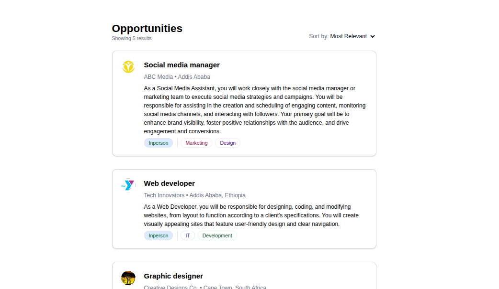
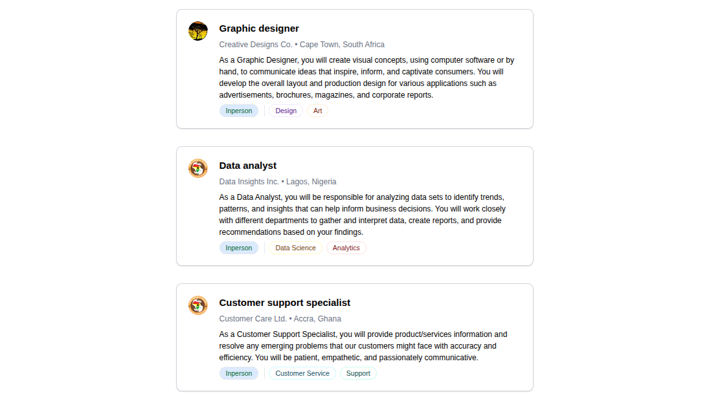
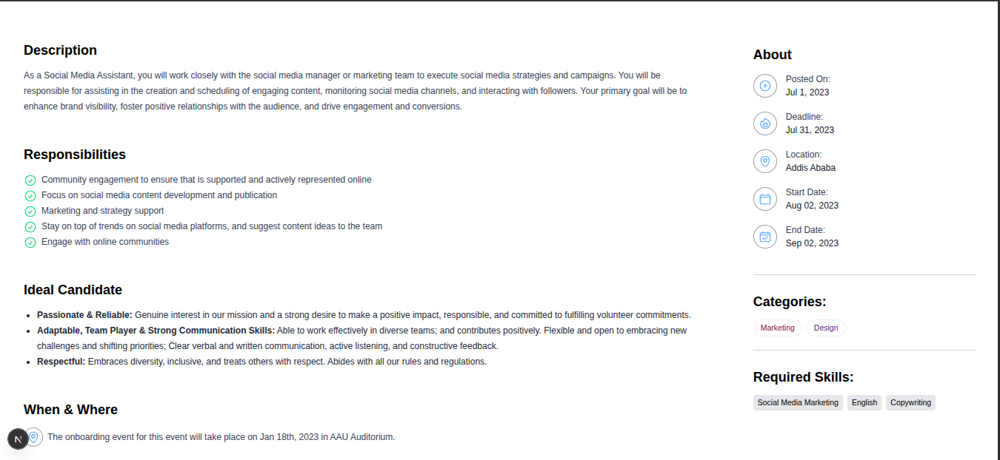

# 💼 Job Listing Application

A modern and responsive Job Listing Dashboard built with **React (Next.js)** and **Tailwind CSS**, designed to showcase job applicants and listings in a clean, professional UI. This project is part of a hands-on task series to master frontend development through building real-world projects.

---

## 🚀 Features

- 🔹 Fully functional job listing card UI
- 📄 Dummy JSON data rendered dynamically
- 🧑‍💼 Avatar image integration for each job applicant
- 📋 Detailed dashboard layout from Figma UI reference
- ⚡ Styled entirely with Tailwind CSS

---

## 📸 Screenshots

### 🔹 Job Listing Page (Dashboard View)

Displays a list of job applicant cards using dummy data and styled with Tailwind.


> *Shows multiple applicant/job cards rendered dynamically.*


> *Demonstrates responsive layout and UI consistency with avatar and details.*

---

### 🔹 Job Detail View

Displays a single job description with applicant details.


> *Includes job title, description, and stylized UI with proper spacing and hierarchy.*

---

## 🛠️ Tech Stack

- **Framework**: [Next.js 15](https://nextjs.org)
- **React**: v19
- **Styling**: [Tailwind CSS v4](https://tailwindcss.com)
- **Icons**: [Heroicons](https://heroicons.com)

---

## 📁 Project Structure
```bash
job-listing-app/
│
├── app/
│   ├── jobs/                        # Route folder for job-related pages
│   ├── layout.tsx                   # App layout
│   ├── page.tsx                     # Home page (Job Listing Dashboard)
│   └── globals.css                  # Tailwind base styles
│
├── assets/
│   ├── screenshots/                 # Screenshot images for README
│   │   ├── jobdetail.png
│   │   ├── joblist1.png
│   │   └── joblist2.png
│   ├── job1.png                     # Avatar image 1
│   ├── job2.png                     # Avatar image 2
│   ├── job3.png                     # Avatar image 3
│   └── job4.png                     # Avatar image 4
│
├── components/
│   ├── JobCard.tsx                  # Job card UI component
│   ├── tag.tsx                      # Tag/Badge component
│   └── about.tsx                    # About section (optional)
│
├── lib/
│   └── data/
│       └── jobs.json                # Dummy JSON data for job listings
│
├── type/
│   ├── about.ts                     # Type definitions for about section
│   └── jobs.ts                      # Type definitions for job data
│
├── .gitignore
├── README.md
├── package.json
├── package-lock.json
├── tsconfig.json
├── next.config.ts
├── postcss.config.mjs
├── eslint.config.mjs
└── next-env.d.ts
```
---

## 📦 Installation & Setup

```bash
# Clone the repository
git clone https://github.com/BeamSol/A2SV-Web-Project-Phase.git

# Navigate into the project
cd job-listing-app

# Install dependencies
npm install

# Run development server
npm run dev
```
--- 

## 🙌 Author

**Beamlak Solomon**  
Software Engineering Student | Frontend Developer 
[LinkedIn](https://www.linkedin.com/in/beamlak-solomon-540890264/) | [GitHub](https://github.com/BeamSol)

---