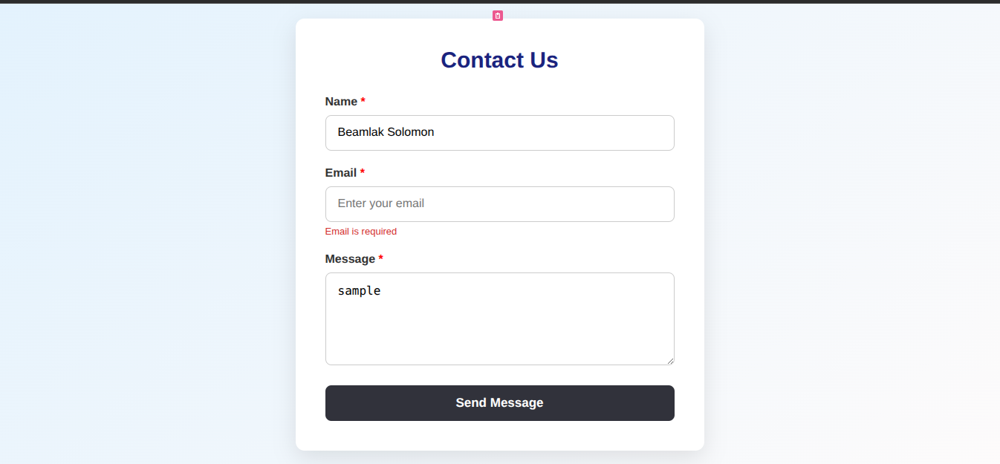
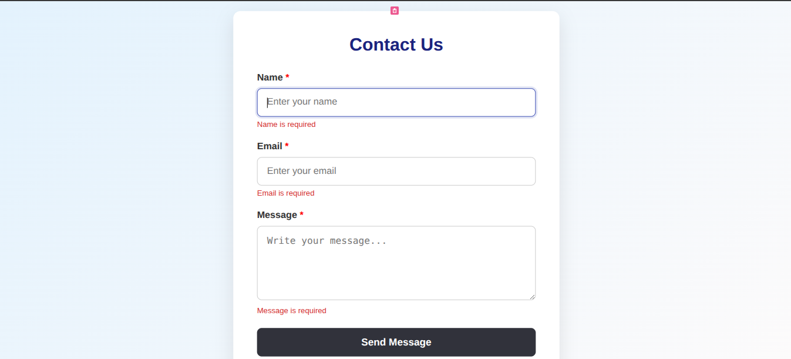
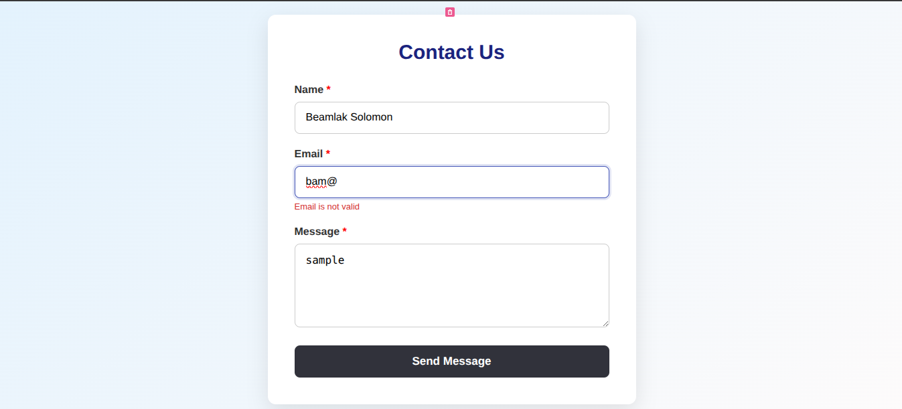
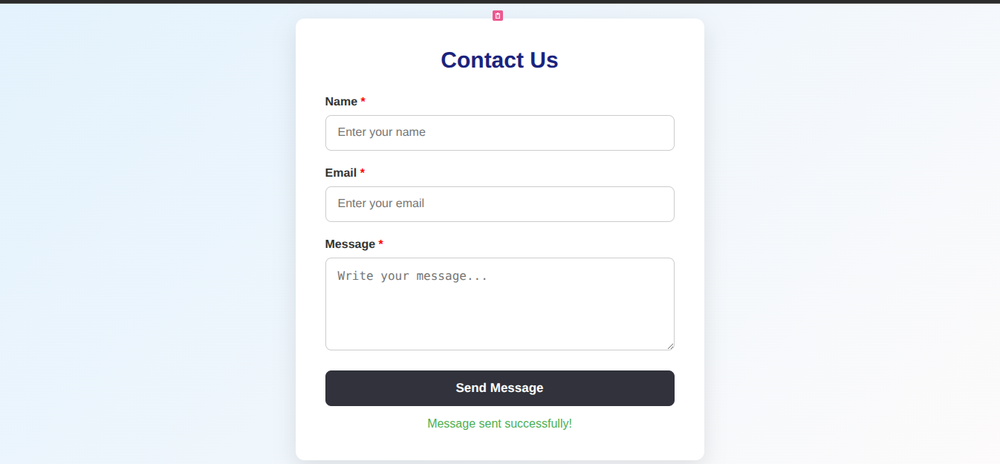
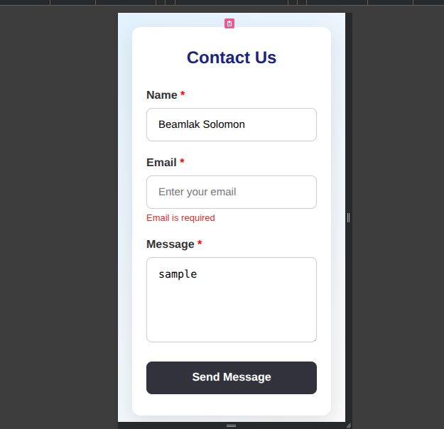

# 📬 Contact Form 

This is a simple and responsive **Contact Form** built using **React** and the `react-hook-form` library. It demonstrates how to manage form state and validation using the `useForm` hook.

---

## ✅ Features

- Form fields:
  - Name (required)
  - Email (required, valid format)
  - Message (required)
- Form validation and error handling
- Form reset on successful submit
- Responsive design using plain CSS

---

### 📦 Run Locally

1. Clone this repository:

```bash
git clone https://github.com/BeamSol/A2SV-Web-Project-Phase.git
```
2. Navigate to the project folder:

```bash
cd task-five-contactForm
```
3. Install dependencies:

```bash
npm install
```

4. Start the development server:

```bash
npm run dev
```

## 📷 Screenshots

### 🔹 Contact Form – Initial View
Basic contact form with Name, Email, and Message inputs.


> *Displays the form with placeholder inputs and a submit button.*

---

### 🔹 Error Messages – Required Fields
Shows validation errors when required fields are left empty.


> *"Name is required", "Email is required", and "Message is required" errors shown.*

---

### 🔹 Invalid Email Format
Displays an error for an incorrectly formatted email address.


> *Shows "Please enter a valid email address." message.*

---

### 🔹 Successful Submission
Form after successful submission with confirmation message.


> *Shows a success message like "Thank you! Your message has been sent."*

---

### 🔹 Responsive View – Mobile Device
Form layout adapts to smaller screens for mobile responsiveness.


> *Responsive layout ensures usability across all screen sizes.*


## 📦 Tech Stack

- React
- TypeScript
- react-hook-form
- CSS

---

## 🧪 Validation

- Empty inputs are not allowed.
- Email format must be valid.
- Error messages display below each invalid field.


## 🙌 Author

**Beamlak Solomon**  
Software Engineering Student | Frontend Developer 
[LinkedIn](https://www.linkedin.com/in/beamlak-solomon-540890264/) | [GitHub](https://github.com/BeamSol)

---