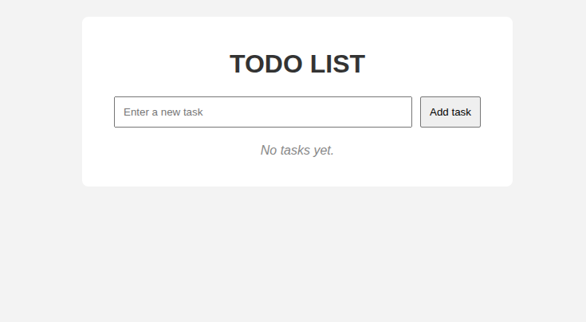
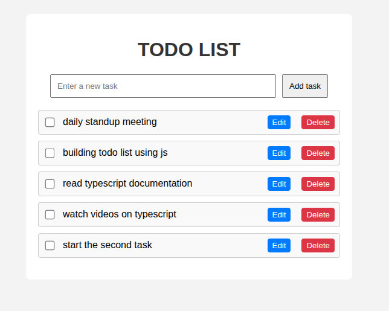
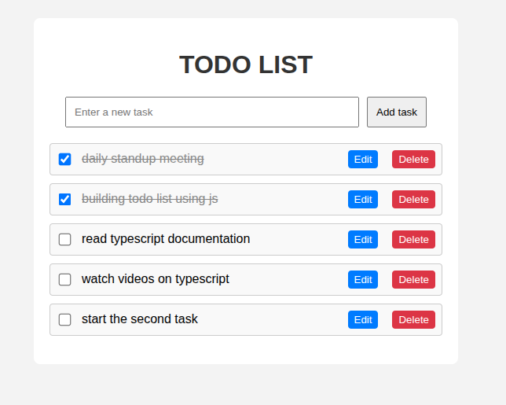
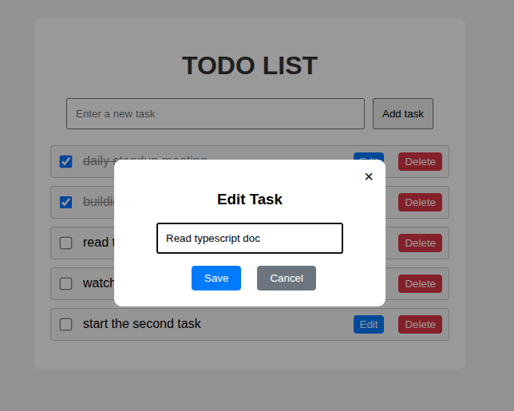
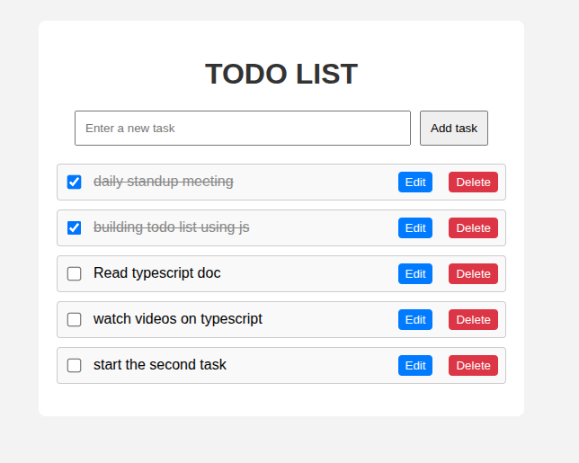

# 📝 Todo List App

A simple and responsive **Todo List Web Application** that allows users to:

- Add tasks
- Mark tasks as completed
- Edit existing tasks in a modal popup
- Delete tasks
- View a dynamic message when no tasks are present

This project is built using **HTML**, **CSS**, and **JavaScript** only.  
No frameworks or external libraries required.

---

## 🚀 Getting Started

### ✅ Requirements
- A modern web browser (Chrome, Firefox, Edge, etc.)
- [Optional] A local server like Live Server for smoother experience

### 📦 Run Locally

1. Clone this repository or download the ZIP:
    ```bash
    git clone https://github.com/BeamSol/A2SV-Web-Project-Phase.git
    ```

2. Navigate to the project directory:
    ```bash
    cd todo-list-app
    ```

3. Open `index.html` in your browser  
   OR  
   Use a local server like **Live Server** (VS Code extension) for best experience.

---

## 📷 Screenshots

### 🔹 Home Page – No Tasks Yet
Displays a message when there are no tasks.


> *The app displays "No tasks yet." message when the task list is empty.*

---

### 🔹 Add New Task
User adds a new task using the input field.


> *User can type and click "Add Task" to append a new item.*

---

### 🔹 Mark Task as Done
Checkbox toggles task completion with a line-through.


> *Tasks marked as completed get a line-through style and dimmed color.*

---

### 🔹 Edit Task – Modal Popup
Clicking edit opens a modal to update the task.


> *Tasks can be edited via a popup modal with Save and Cancel options.*

---

### 🔹 Delete Task
Tasks can be removed from the list by clicking the delete button.


> *Tasks are removed instantly and "No tasks yet." will reappear if list is empty.*

---

## 📁 Project Structure

```
todo-list-app/
│
├── index.html # Main HTML structure
├── style.css # All styles
├── script.js # JavaScript logic
├── README.md # This documentation
└── screenshots/ # Screenshots used in README
```

## 🙌 Author

**Beamlak Solomon**  
Frontend Developer | Software Engineer  
[LinkedIn](https://www.linkedin.com/in/beamlak-solomon-540890264/) | [GitHub](https://github.com/BeamSol)

---