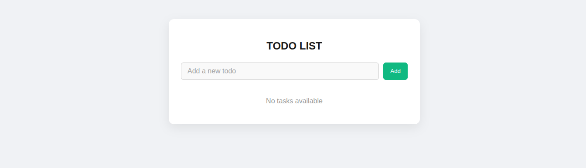
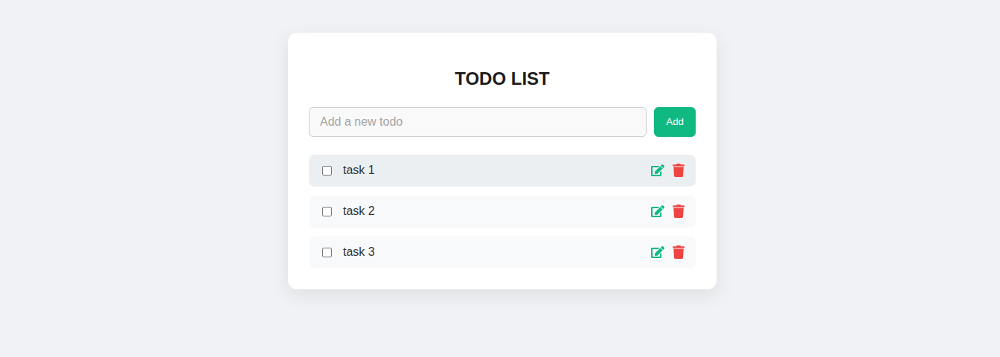
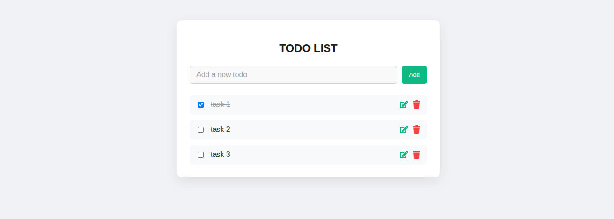
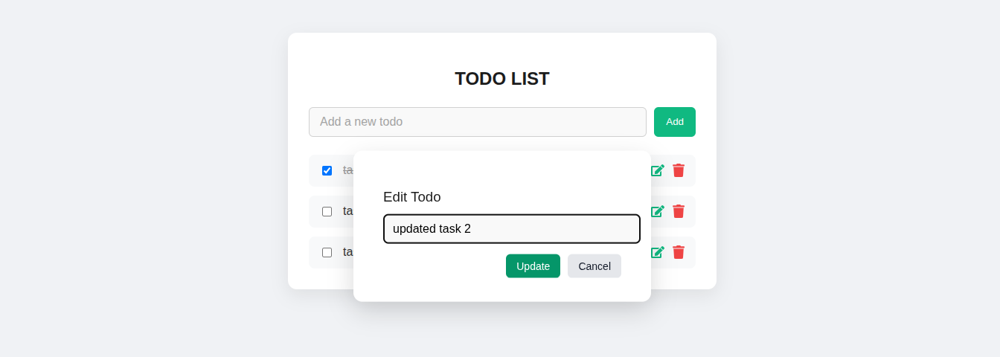
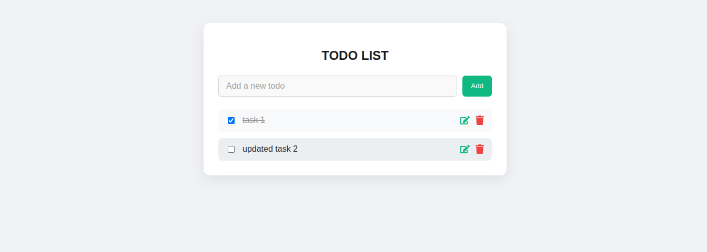

# Todo List App (React + TypeScript)

A modern and responsive **Todo List Web Application** built with **React**, **TypeScript**, and **CSS**. It features:

- Task creation
- Completion toggling (with strikethrough)
- Editing through a popup modal
- Deletion with icon
- Clean and professional UI with dynamic empty state

---

## 🚀 Getting Started

###  Requirements
- Node.js installed (v16 or above recommended)
- A modern browser (Chrome, Firefox, Edge)
- Code editor like **VS Code**

---

### 📦 Run Locally

1. Clone this repository:

```bash
git clone https://github.com/your-username/task-three-Todo-react.git
```
2. Navigate to the project folder:

```bash
cd task-three-Todo-react
```
3. Install dependencies:

```bash
npm install
```

4. Start the development server:

```bash
npm run dev
```

## 🧩 Features

✅ Add new tasks

✅ Mark tasks as completed (with strikethrough)

✅ Edit tasks in a popup modal

✅ Delete tasks using icons

✅ Responsive and user-friendly UI

✅ Shows message when task list is empty

## 📷 Screenshots

### 🔹 Home Page – No Tasks Yet
Displays a message when there are no tasks.


> *The app displays "No tasks yet." message when the task list is empty.*

---

### 🔹 Add New Task
User adds a new task using the input field.


> *User can type and click "Add Task" to append a new item.*

---

### 🔹 Mark Task as Done
Checkbox toggles task completion with a line-through.


> *Tasks marked as completed get a line-through style and dimmed color.*

---

### 🔹 Edit Task – Modal Popup
Clicking edit opens a modal to update the task.


> *Tasks can be edited via a popup modal with Save and Cancel options.*

---

### 🔹 Delete Task
Tasks can be removed from the list by clicking the delete button.


> *Tasks are removed instantly and "No tasks yet." will reappear if list is empty.*

---

## 📁 Project Structure
```bash
task-three-Todo-react/
│
├── public/
├── src/
│   ├── components/
│   │   └── TodoList.tsx     # Main todo component
│   ├── css/
│   │   └── TodoList.css     # App styling
│   ├── App.tsx              # Root component
│   ├── main.tsx             # Entry point
│   ├── TodoService.ts       # Local service for managing todos
│   ├── todo.ts              # Type definitions
│
├── assets/                 
│   ├── no-tasks.png
│   ├── add-task.png
│   ├── mark-done.png
│   ├── edit-modal.png
│   ├── after-edit.png
│   └── delete-task.png                
├── package.json
├── tsconfig.json
├── vite.config.ts
└── README.md                # This documentation
```
## 🛠️ Built With
- React
- TypeScript
- React Icons
- Vite (for fast dev build)
- CSS (No frameworks)

---

## 🙌 Author

**Beamlak Solomon**

- Software Engineering Student | Frontend Developer
- 🌐 [GitHub](https://github.com/BeamSol) • 💼 [LinkedIn](https://www.linkedin.com/in/beamlak-solomon-540890264/)

---